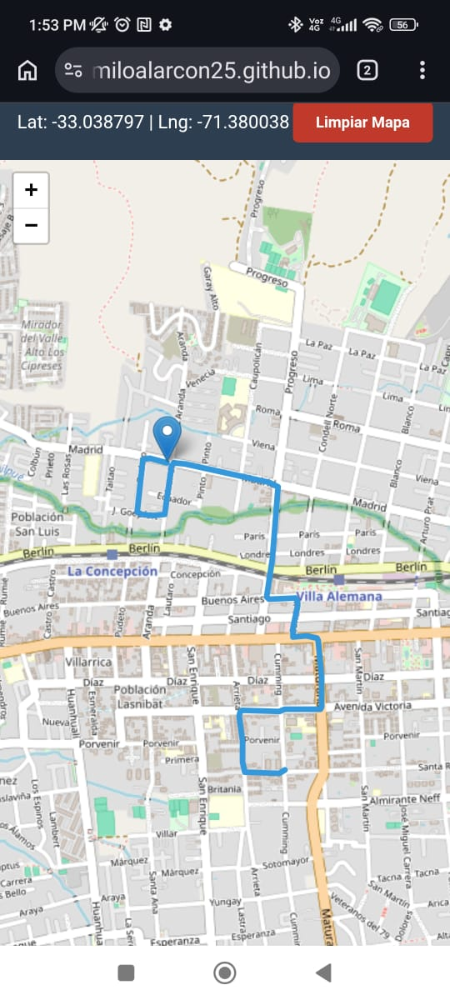
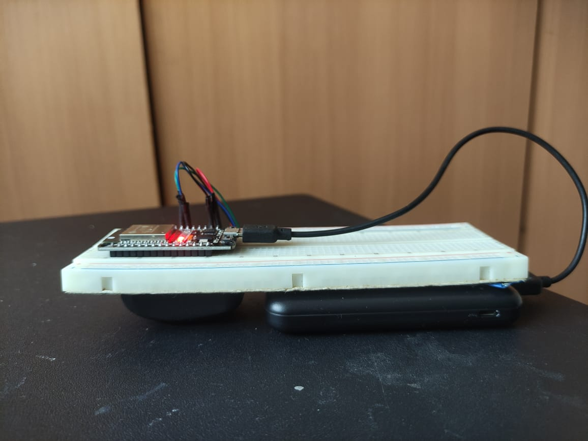

# GPS Tracker Pro - Versión 2.0

Bienvenido a la segunda versión del **Proyecto de Monitoreo Electrónico**. Este sistema permite el rastreo en tiempo real de un dispositivo mediante un módulo GPS y un ESP32, visualizando el recorrido de forma interactiva en una aplicación web personalizada.

## 🌐 Acceso a la App
Puedes visualizar la interfaz de monitoreo en el siguiente enlace:
👉 **[Ir a GPS Tracker Pro](https://camiloalarcon25.github.io/Sistema-de-Monitoreo-Electr-nico-V2/)**

---

## 🚀 Mejoras en la Versión 2.0

*   **Arquitectura Modular:** Separación clara entre estructura (`index.html`), estilos (`style.css`) y lógica de control (`script.js`).
*   **Visualización de Datos:** Cálculo en tiempo real de la distancia total recorrida y tiempo de sesión.
*   **Historial Persistente:** Capacidad para guardar rutas localmente en el navegador y consultarlas posteriormente.
*   **Diseño Responsive:** Interfaz adaptada para dispositivos móviles con botones de acción táctil de mayor tamaño.
*   **UX Mejorada:** Mapa interactivo con marcado automático de punto de inicio y limpieza de trayectoria.

## 📸 Galería del Proyecto

| Visualización en Navegador (App) | Prototipo Montado (Hardware) |
| :---: | :---: |
|  |  |
| *Interfaz Web GPS Tracker* | *ESP32 + Módulo GPS* |

*Nota: Asegúrate de reemplazar "foto_app.jpg" y "foto_hardware.jpg" por los nombres reales de tus archivos.*

## 🛠️ Tecnologías Utilizadas

*   **Hardware:** ESP32 y Módulo GPS.
*   **Frontend:** HTML5, CSS3, JavaScript.
*   **Mapas:** [Leaflet.js](https://leafletjs.com/) con capas de OpenStreetMap.

## 🚀 Cómo empezar

1.  Asegúrate de que tu ESP32 esté conectado a la misma red WiFi que tu dispositivo.
2.  Configura la dirección IP de tu ESP32 en el archivo `script.js`.
3.  Accede a la [App Online](https://camiloalarcon25.github.io/Sistema-de-Monitoreo-Electr-nico-V2/) para comenzar el monitoreo.

---
*Desarrollado como parte del proyecto de monitoreo electrónico personal.*
